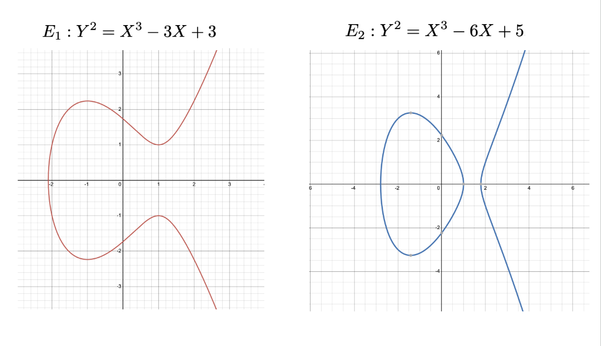

# Elliptical-Curves-and-Cryptography

## Overview

This project explores Elliptical Curves and their Applications in Modern Cryptosystems like El Gamal, and its implementation in code.

## What are Elliptical Curves? ⧼

The set of solutions to a Weierstrass equation is an **elliptic curve**. 

        Weierstrass Equation: Y^2 = X^3 + AX + B

(A and B must be constants that satisfy the property 4A^3 + 27B^2 /= 0 since the cubic roots of this form will include complex numbers.)

**Ideal Point**: a point defined on the projective plane at infinity

So why is this information important?

There is a property in which any two points on a elliptic curve will yield a third point by doing a special operation called "adding" (entirely different from +).

Here are some example elliptical curves:

## Usage in El Gamal ⚡️

What is El Gamal?

El Gamal is an assymetric cryptosystem with two private keys.

Here is an example with elliptic curves:

Alice and Bob agree on:
- elliptic curve, E(Fp)
- large prime p
- a point P ∊ E(Fp)

Setup:
Alice: picks secret integer nA and computes QA = nAP, her public key
Bob: picks his message M∊ E(Fp) and a random private key k in {1…p}

Encryption:
Alice shares QA with Bob
Bob computes C₁ = kP and C₂ = M + kQA and shares the tuple (C₁, C₂) with Alice

Decryption:
Alice computes C₂ - nAC₁ = (M + kQA) - nA(kP) = M + k(nAP) - nA(kP) = M

Success! They have a shared secret key value that they can use as a key to communicate privately via symmetric cipher.

## Usage in Diffie-Hellman Key Exchange 🗝️

What is the Diffie-Hellman Key Exchange?

Symmetric key exchange cryotography.

Alice and Bob agree on:
- elliptic curve, E(Fp)
- large prime p
- a point P ∊ E(Fp)
- 
Encryption:
Alice: picks secret integer nA and computes QA = nAP 
Bob: picks secret integer nB and computes QB = nBP
Exchange QA and QB with each other (public)

Decryption:
Alice computes nAQB = nAnBP
Bob computes nBQA = nBnAP

Success! They have a shared secret key value that they can use as a key to communicate privately via symmetric cipher.

## Advantages 𝌙

## Inefficencies & Proposed Solutions 🖇️

## Remarks 🗯️

## License
This project is under the [MIT License](LICENSE)
